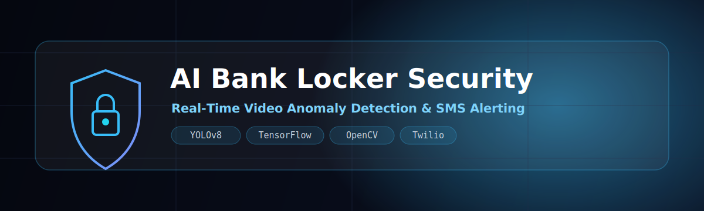
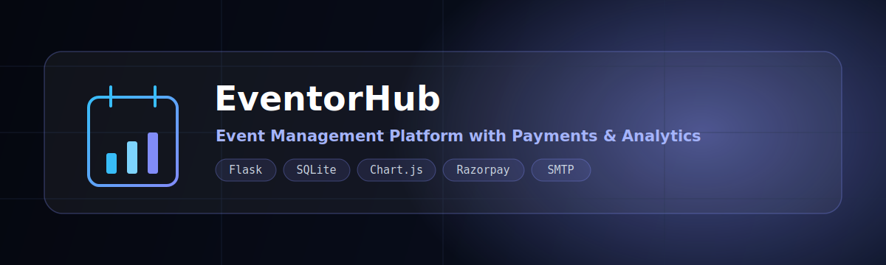

<!-- ============================================================= -->
<!--                      PRASANNA N · PROFILE                     -->
<!--        Premium AI-themed GitHub developer landing page        -->
<!-- ============================================================= -->

<div align="center">



<!-- ===================== TYPING EFFECT ===================== -->
<a href="https://www.prasannainfo.website">
  
</a>

<br/>

<!-- ===================== SOCIAL BUTTONS ===================== -->
<a href="https://www.prasannainfo.website">
  
</a>
<a href="https://linkedin.com/in/praxmadhan">
  
</a>
<a href="mailto:prasannanagaraj33@gmail.com">
  
</a>
<a href="https://github.com/praxmadhan">
  
</a>

<br/>


</div>

<br/>

<!-- ============================================================= -->
<!--                          ABOUT ME                             -->
<!-- ============================================================= -->

##  &nbsp;About Me

<table>
<tr>
<td width="60%" valign="top">

```yaml
Prasanna N:
  role:          Software Engineer
  also:          [ Full Stack Developer, AI Engineer ]
  location:      Madurai, Tamil Nadu, India 🇮🇳
  education:     B.Tech · Information Technology
  currently:    Software Engineer Intern
  mindset:       Open Source Learner
  focus:
    - AI Business Website Generator
    - Cloud & AI Agents (AWS)
    - React · Full Stack Systems
  mission: >
    Building AI-powered applications, scalable web
    software, and intelligent automation that solve
    real-world problems.
```

</td>
<td width="40%" valign="top">

> ### 🎯 Current Focus
> ```
> ⚡ AI Business Website Generator
> 🤖 AI Agents & Automation
> ☁️  Cloud · AWS
> ⚛️  React · Full Stack
> ```
>
> ### 💡 Open to
> ```
> AI Projects · SaaS Products
> Full Stack Apps · Open Source
> ```

</td>
</tr>
</table>

<br/>

<!-- ============================================================= -->
<!--                         TECH STACK                            -->
<!-- ============================================================= -->

##  &nbsp;Tech Stack

<div align="center">

**Languages**


**Frontend**


**Backend & Databases**


**AI / Machine Learning**


**Developer & AI Tools**


</div>

<br/>

<!-- ============================================================= -->
<!--                        WHAT I BUILD                           -->
<!-- ============================================================= -->

##  &nbsp;What I Build

<div align="center">
<table>
<tr>
<td align="center" width="33%">🤖<br/><b>AI Applications</b></td>
<td align="center" width="33%">🌐<br/><b>Full Stack Web Apps</b></td>
<td align="center" width="33%">🏢<br/><b>Business Websites</b></td>
</tr>
<tr>
<td align="center">⚙️<br/><b>Automation Systems</b></td>
<td align="center">☁️<br/><b>Cloud Applications</b></td>
<td align="center">🚀<br/><b>SaaS Products</b></td>
</tr>
</table>
</div>

<br/>

<!-- ============================================================= -->
<!--                   PROFESSIONAL EXPERIENCE                     -->
<!-- ============================================================= -->

##  &nbsp;Professional Experience

<table>
<tr>
<td valign="top">

### 🏢 Ad Soft Technologies &nbsp;·&nbsp; `Software Engineer Intern`
`Apr 2026 – Present`

Contributing as part of the software engineering team on real-world client applications:

&nbsp;&nbsp;💎 **Aarohi Bridals** — E-commerce platform &nbsp;·&nbsp; 🏥 **Healthcare Platform** &nbsp;·&nbsp; ⛪ **Church Community Website**

**Responsibilities**

`Frontend Development` &nbsp; `Backend Development` &nbsp; `API Integration` &nbsp; `Responsive UI`
`Deployment` &nbsp; `Bug Fixing` &nbsp; `Performance Optimization` &nbsp; `Team Collaboration`

</td>
</tr>
</table>

<br/>

<!-- ============================================================= -->
<!--                      FEATURED PROJECTS                        -->
<!-- ============================================================= -->

##  &nbsp;Featured Projects

<a href="https://github.com/praxmadhan">
  
</a>

> **Real-time video anomaly detection** surveillance system that spots suspicious activity and instantly alerts users via SMS.
> **Features:** Real-time detection · SMS alerts · Snapshot capture · Warning alarm · Deep learning inference
> **Tech:** `Python` `YOLOv8` `TensorFlow` `OpenCV` `Twilio API`  &nbsp;·&nbsp;  ⭐ _Final Year Project_

<br/>

<a href="https://github.com/praxmadhan">
  
</a>

> **College event management platform** with online registration, payments, analytics and an admin dashboard.
> **Features:** Role-based login · Event management · Payment gateway · Email confirmation · Analytics dashboard
> **Tech:** `Flask` `SQLite` `Chart.js` `Razorpay` `SMTP`  &nbsp;·&nbsp;  ✅ _Completed_

<br/>

<a href="https://www.prasannainfo.website">
  
</a>

> **Personal developer portfolio** with a modern, responsive design, custom domain and an integrated AI chatbot.
> **Features:** Responsive UI · Custom domain · AI chatbot · Contact section
> **Live:** [www.prasannainfo.website](https://www.prasannainfo.website)  &nbsp;·&nbsp;  🟢 _Live_

<br/>

<a href="https://www.aarohibridals.in">
  
</a>

> **E-commerce platform** delivered during my internship at Ad Soft Technologies.
> **My contributions:** Responsive UI · Frontend improvements · Backend integration · Performance optimization · Bug fixes · Deployment support
> **Live:** [www.aarohibridals.in](https://www.aarohibridals.in)  &nbsp;·&nbsp;  🟢 _Live_
>
> 💼 _Contributed as a Software Engineer Intern as part of the development team. The source code is proprietary to the company and is not publicly available._

<br/>

<!-- ============================================================= -->
<!--                       CURRENT FOCUS                           -->
<!-- ============================================================= -->

##  &nbsp;Current Focus — In the Lab 🔬

<a href="https://github.com/praxmadhan">
  
</a>

> Building an AI-powered platform that generates modern business websites from minimal user input — combining **AI Agents**, **LLMs**, **Cloud (AWS)** and **automation** into one product. **Coming Soon 🚀**

<br/>

<!-- ============================================================= -->
<!--                      GITHUB ANALYTICS                         -->
<!-- ============================================================= -->

##  &nbsp;GitHub Analytics

<div align="center">


<br/>


<br/><br/>


<br/><br/>


<br/><br/>


<br/>


</div>

<br/>

<!-- ============================================================= -->
<!--                     CONTRIBUTION SNAKE                        -->
<!-- ============================================================= -->

## 🐍 Contribution Snake

<div align="center">
  <picture>
    <source media="(prefers-color-scheme: dark)" srcset="https://raw.githubusercontent.com/praxmadhan/praxmadhan/output/github-contribution-grid-snake-dark.svg"/>
    <source media="(prefers-color-scheme: light)" srcset="https://raw.githubusercontent.com/praxmadhan/praxmadhan/output/github-contribution-grid-snake.svg"/>
    
  </picture>
</div>

<br/>

<!-- ============================================================= -->
<!--                            FOOTER                             -->
<!-- ============================================================= -->

<div align="center">

> _"Building software isn't just about writing code — it's about solving problems, creating value, and continuously learning."_


**⭐ Thanks for visiting — let's build something intelligent together.**

</div>
